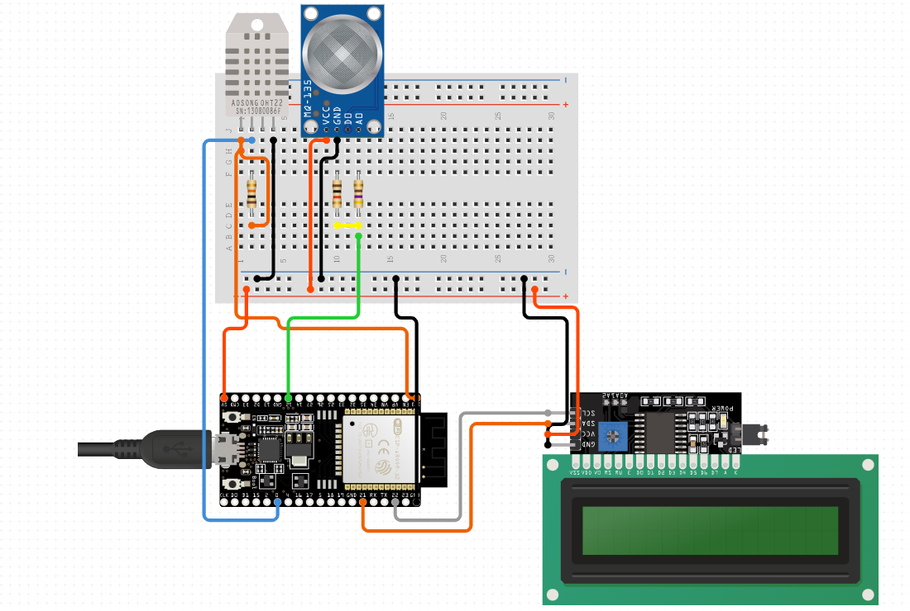
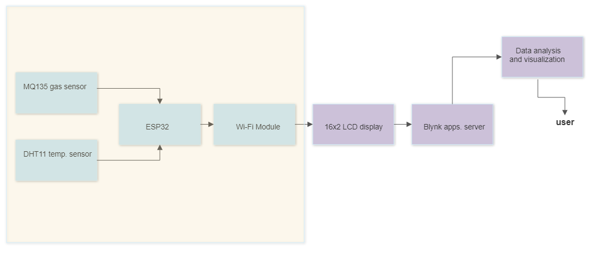
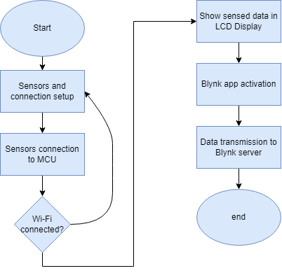
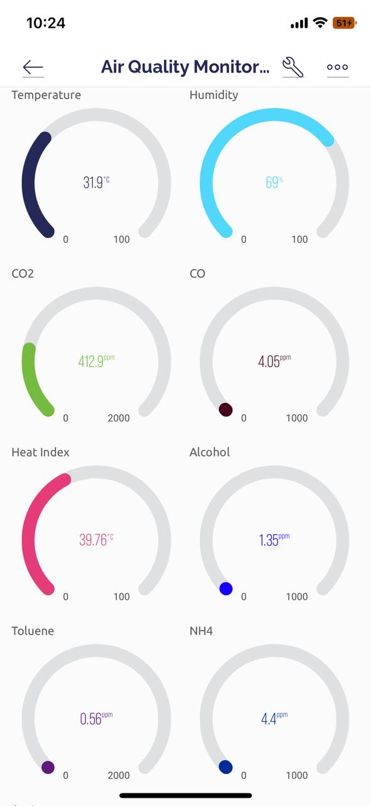
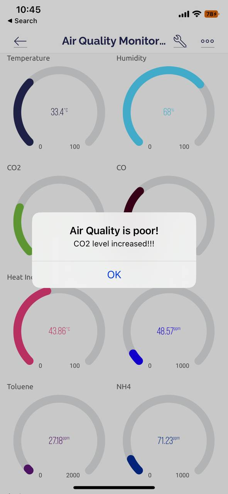

# Air Quality Analyzer using ESP32

This system leverages the ESP32 microcontroller alongside the MQ135 gas sensor and the DHT11 temperature-humidity sensor to continuously monitor air quality metrics. Data is transmitted via Wi-Fi to the Blynk platform, enabling real-time remote visualization and tracking.

---

## Project Structure
```
Air_Quality_Analyzer/
│
├── Code/
│ ├── Air_Quality_Analyzer.ino # Main code for real-time monitoring
│ └── sensor_calibration.ino # Calibration script for MQ135
│
├── Figures/
│ ├── Blynk_App.jpg # Blynk interface screenshot
│ ├── CO2_level_alert.jpg # Alert example
│ ├── block_diagram.jpg # System block diagram
│ ├── flowchart.png # System flowchart
│ └── schematic diagram.png # Circuit schematic
│
└── Report/
  ├──Air Quality Monitoring System.pdf # Final project report

```
---

## How to Use

1. Connect the hardware as shown in the schematic.
2. Upload `sensor_calibration.ino` from the `Code/` folder to calibrate the MQ135 sensor.
3. Note the baseline reading shown in the serial monitor and adjust the threshold in `Air_Quality_Analyzer.ino`.
4. Upload `Air_Quality_Analyzer.ino` to run the full monitoring system.
5. Use the **Blynk app** (configured with your auth token and Wi-Fi credentials) to monitor data and receive alerts.

---

## Features

- Real-time air quality and temperature monitoring
- Displays output on 16x2 LCD
- Sends data and alerts to Blynk mobile app
- Adjustable CO₂ and gas level thresholds
- Easy calibration for MQ135 gas sensor

---

## Screenshots

### Circuit Setup


### Block Diagram


### Flowchart


### Blynk App Interface


### Alert Notification


---

## Project Report

Full documentation is available in the `Report/` folder:

[Air Quality Monitoring System.pdf](Air_Quality_Analyzer/Report/Air%20Quality%20Monitoring%20System.pdf)

---

## Hardware Used

- ESP32 Dev Board
- MQ135 Gas Sensor
- DHT11 Temperature & Humidity Sensor
- 16x2 LCD Display
- Breadboard & Jumper Wires
- Blynk App (Mobile)

---

## Libraries Required

Make sure to install these libraries in the Arduino IDE:

- `DHT sensor library by Adafruit`
- `Adafruit Unified Sensor`
- `LiquidCrystal_I2C`
- `Blynk` library for ESP32

---
 


